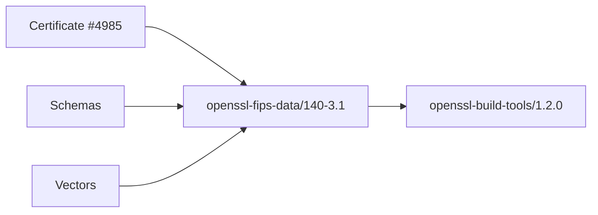

# OpenSSL FIPS Policy - AI Context

Role: FIPS 140-3 compliance data for government deployments.

Certificate: #4985 (Level 1) with validated algorithms and platforms.

Usage:
- Consumed by `openssl-build-tools` when `deployment_target=fips-government`.
- Exposes `FIPS_DATA_ROOT` for consumers.

Architecture:

