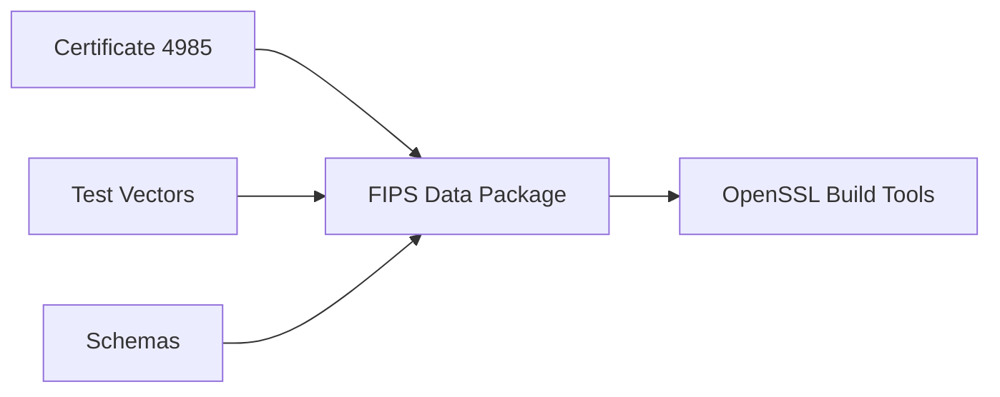

# OpenSSL FIPS Policy

This repository contains the FIPS 140-3 compliance policy and configuration files for OpenSSL.

## Overview

The FIPS 140-3 standard specifies security requirements for cryptographic modules. This package provides:

- FIPS module configuration (`fipsmodule.cnf`)
- Security policy documentation
- Compliance validation scripts
- Integration with OpenSSL FIPS provider

## FIPS 140-3 Compliance

This package supports FIPS 140-3 compliance for OpenSSL 3.3.0 with the following approved algorithms:

### Approved Cryptographic Algorithms
- **Symmetric Ciphers**: AES-256-GCM, AES-256-CBC, AES-256-CTR, AES-128-GCM, AES-128-CBC, AES-128-CTR
- **Hash Functions**: SHA3-512, SHA3-384, SHA3-256, SHA-512, SHA-384, SHA-256
- **Message Authentication**: HMAC
- **Key Agreement**: ECDH
- **Digital Signatures**: RSA, ECDSA
- **Key Management**: RSA, EC, HKDF

### Security Requirements
- Cryptographic module authentication through HMAC
- Self-tests for algorithm validation
- Conditional error handling
- Security checks and boundary validation

## FIPS Validation Automation

This repository includes comprehensive automation for FIPS 140-3 module validation and compliance testing.

### Quick Start

```bash
# Run automated FIPS validation
./scripts/fips-validation/fips-compliance-validation.sh

# Or trigger via GitHub Actions
# Push to main branch or use workflow dispatch
```

### Validation Features

- ✅ **FIPS-Enabled Build**: Automated OpenSSL FIPS builds with Conan
- ✅ **Module Verification**: FIPS module integrity and self-test validation
- ✅ **Cross-Platform Testing**: Matrix testing across Ubuntu, Windows, macOS
- ✅ **Algorithm Validation**: Ensures approved algorithms work, restricted ones fail
- ✅ **Deprecated API Detection**: Compilation tests and CodeQL security scans
- ✅ **SBOM Generation**: Software bill of materials with certificate extraction
- ✅ **Security Scanning**: Vulnerability assessment with Trivy
- ✅ **Performance Assurance**: <8 minute runtime validation

## Installation

### Conan Package
```bash
conan install openssl-fips-policy/3.3.0@
```

### Manual Installation
```bash
# Copy FIPS configuration
cp fipsmodule.cnf /etc/ssl/openssl-fips.cnf

# Set environment variables
export OPENSSL_FIPS=1
export OPENSSL_CONF=/etc/ssl/openssl-fips.cnf
```

## Usage

### Enable FIPS Mode
```bash
# Using OpenSSL command line
openssl list -providers

# Should show: fips
```

### Validate FIPS Compliance
```bash
# Run FIPS self-tests
openssl fipsinstall -out fipsmodule.cnf -module /path/to/fips.so

# Verify FIPS provider
openssl list -provider fips -verbose
```

## Configuration

The `fipsmodule.cnf` file contains:

- Provider sections for FIPS and base providers
- Algorithm definitions for approved cryptography
- Security settings and conditional error handling
- Module MAC for integrity verification

## Integration

### With OpenSSL Build
```cmake
find_package(OpenSSL REQUIRED)
target_link_libraries(myapp OpenSSL::SSL OpenSSL::Crypto)

# Enable FIPS
set(OPENSSL_FIPS ON)
```

### With Conan
```python
def requirements(self):
    self.requires("openssl-fips-policy/3.3.0")

def package_info(self):
    self.conf_info.define("openssl:fips_config", self.package_folder)
```

## Architecture

Schemas
------
This repository reserves `fips-140-3/schemas/` for future JSON schema validation of certificate and vector formats.



## Security Considerations

- FIPS mode restricts available algorithms to approved ones only
- Self-tests must pass before cryptographic operations are allowed
- FIPS provider must be properly installed and configured
- Module integrity must be maintained

## Documentation

- [OpenSSL FIPS Security Policy](https://www.openssl.org/docs/fips/)
- [FIPS 140-3 Standard](https://csrc.nist.gov/publications/detail/fips/140/3/final)
- [OpenSSL Provider Documentation](https://www.openssl.org/docs/man3.3/man7/provider.html)

## Support

For FIPS compliance questions:
- OpenSSL Security Team: security@openssl.org
- NIST FIPS Resources: https://csrc.nist.gov/projects/cryptographic-module-validation-program

## License

This project is licensed under the Apache License 2.0 - see the LICENSE file for details.
<<<<<<< HEAD
FIPS 140-3 policy definitions and compliance artifacts for Certificate #4985.

## FIPS Validation Automation

This repository includes comprehensive automation for FIPS 140-3 module validation and compliance testing.

### Quick Start

```bash
# Run automated FIPS validation
./scripts/fips-validation/fips-compliance-validation.sh

# Or trigger via GitHub Actions
# Push to main branch or use workflow dispatch
```

### Validation Features

- ✅ **FIPS-Enabled Build**: Automated OpenSSL FIPS builds with Conan
- ✅ **Module Verification**: FIPS module integrity and self-test validation
- ✅ **Cross-Platform Testing**: Matrix testing across Ubuntu, Windows, macOS
- ✅ **Algorithm Validation**: Ensures approved algorithms work, restricted ones fail
- ✅ **Deprecated API Detection**: Compilation tests and CodeQL security scans
- ✅ **SBOM Generation**: Software bill of materials with certificate extraction
- ✅ **Security Scanning**: Vulnerability assessment with Trivy
- ✅ **Performance Assurance**: <8 minute runtime validation

## Usage

```bash
conan remote add ${CONAN_REPOSITORY_NAME} ${CONAN_REPOSITORY_URL} --force
conan install --requires=openssl-fips-data/140-3.1 -r=${CONAN_REPOSITORY_NAME}
```

## Architecture

Schemas
------
This repository reserves `fips-140-3/schemas/` for future JSON schema validation of certificate and vector formats.


