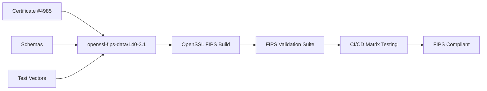

# OpenSSL FIPS Policy

FIPS 140-3 policy definitions and compliance artifacts with comprehensive validation automation.

Certificate: #4985 (Level 1) with validated algorithms and platforms.

## Quick Start

Run complete FIPS validation:
```bash
./scripts/run-fips-validation.sh [profile]
```

## Automated Validation

This repository provides comprehensive automation for FIPS 140-3 compliance validation including:

### Build & Validation Scripts
- `scripts/build-fips-openssl.sh` - Build FIPS-enabled OpenSSL via Conan
- `scripts/validate-fips-module.sh` - FIPS module self-tests and checksum validation
- `scripts/test-algorithm-restrictions.sh` - Algorithm approval/rejection testing
- `scripts/test-deprecated-apis.sh` - Deprecated API compilation rejection
- `scripts/generate-sbom-security-scan.sh` - SBOM generation and security scanning

### CI/CD Integration
- `.github/workflows/fips-validation.yml` - Cross-platform matrix testing
- CodeQL rules for deprecated API detection
- Performance monitoring (<8min execution time)

### Validation Coverage
✅ FIPS module self-tests with HMAC-SHA256 validation
✅ Per-platform fipsmodule.cnf generation
✅ Algorithm restrictions (SHA256 works, MD5/RC4/DES fail)
✅ Approved algorithms: AES-256-GCM, SHA-256/384, RSA-2048, ECDSA-P256
✅ Deprecated API rejection at compile time
✅ SBOM generation with CMVP certificate extraction
✅ Security scanning with trivy (critical severity only)
✅ Cross-platform testing (Ubuntu 22.04/24.04, Windows 2022, macOS 14)
✅ Runtime performance monitoring (<8min total execution)

## Usage

### Local Development
```bash
# Run complete validation suite
./scripts/run-fips-validation.sh linux-gcc11

# Individual validation steps
./scripts/build-fips-openssl.sh 3.0.8 linux-gcc11
./scripts/validate-fips-module.sh
./scripts/test-algorithm-restrictions.sh
./scripts/test-deprecated-apis.sh
./scripts/generate-sbom-security-scan.sh
```

### CI/CD Deployment
The validation runs automatically on:
- Push to main branch
- Pull requests to main branch
- Manual workflow dispatch

Results are uploaded as artifacts for each platform.

## Conan Integration

```bash
conan remote add ${CONAN_REPOSITORY_NAME} ${CONAN_REPOSITORY_URL} --force
conan create conanfile-openssl.py --name=openssl-fips --version=3.0.8 --profile=linux-gcc11 -o fips=True
```

## Architecture



## Security & Compliance

- **Certificate**: #4985 (FIPS 140-3 Level 1)
- **Algorithms**: AES-256-GCM, SHA-256/384, RSA-2048, ECDSA-P256
- **Platforms**: Linux x86_64 (RHEL 8/9), Windows x86_64 (Server 2019+)
- **Validation**: Automated self-tests, algorithm restrictions, deprecated API detection
- **SBOM**: SPDX format with CMVP certificate verification
- **Security**: Trivy scanning for critical vulnerabilities only
