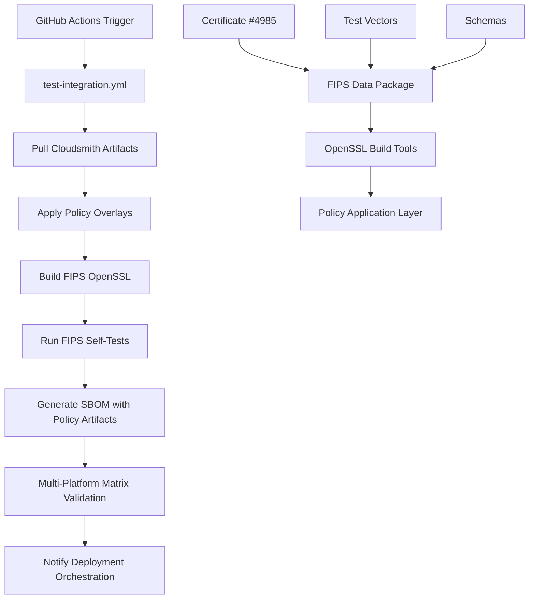

# OpenSSL FIPS Policy

FIPS 140-3 policy definitions and compliance artifacts for Certificate #4985.

## FIPS Validation Automation

This repository includes comprehensive automation for FIPS 140-3 module validation and compliance testing.

### Quick Start

```bash
# Run automated FIPS validation
./scripts/fips-validation/fips-compliance-validation.sh

# Or trigger via GitHub Actions
# Push to main branch or use workflow dispatch
```

### Validation Features

- ✅ **FIPS-Enabled Build**: Automated OpenSSL FIPS builds with Conan
- ✅ **Module Verification**: FIPS module integrity and self-test validation
- ✅ **Cross-Platform Testing**: Matrix testing across Ubuntu, Windows, macOS
- ✅ **Algorithm Validation**: Ensures approved algorithms work, restricted ones fail
- ✅ **Deprecated API Detection**: Compilation tests and CodeQL security scans
- ✅ **SBOM Generation**: Software bill of materials with certificate extraction
- ✅ **Security Scanning**: Vulnerability assessment with Trivy
- ✅ **Performance Assurance**: <8 minute runtime validation
- ✅ **Policy Integration**: Cloudsmith artifact integration with policy overlays
- ✅ **Multi-Platform Matrix**: Reusable outputs for artifact paths across platforms
- ✅ **Deployment Orchestration**: Fan-out successful policies to application layer

## Usage

### Basic Integration

```bash
conan remote add ${CONAN_REPOSITORY_NAME} ${CONAN_REPOSITORY_URL} --force
conan install --requires=openssl-fips-data/140-3.1 -r=${CONAN_REPOSITORY_NAME}
```

### Domain-Specific Call Wrappers

For government deployments requiring FIPS 140-3 compliance, use these domain-specific wrappers:

#### FIPS Policy Validation

```bash
# Validate FIPS policies with integration testing
./scripts/fips-validation/fips-compliance-validation.sh

# Run platform-specific validation
./scripts/fips-validation/run-platform-tests.sh ubuntu-22.04

# Basic validation with self-tests and SBOM verification
./scripts/fips-validation/test-basic-validation.sh
```

#### GitHub Actions Integration

```yaml
# Call test-integration.yml with FIPS enabled
- name: FIPS Integration Test
  uses: ./.github/workflows/test-integration.yml
  with:
    fips_enabled: true
    openssl_version: "3.4.1"
    test_platforms: "linux"
    cloudsmith_artifacts: true
  secrets: inherit
```

#### Cloudsmith Artifact Integration

```bash
# Pull FIPS policy artifacts from Cloudsmith
conan remote add cloudsmith-fips https://conan.cloudsmith.io/sparesparrow-conan/openssl-fips-policy/ --force
conan remote login cloudsmith-fips sparesparrow --password "$CLOUDSMITH_API_KEY"
conan install openssl-fips-data/140-3.1@sparesparrow/stable -r=cloudsmith-fips --build=missing
```

#### SBOM Generation with Policy Artifacts

```bash
# Generate SBOM including policy artifacts
./scripts/generate-sbom-security-scan.sh

# Verify policy artifacts are included
jq '.packages[] | select(.name | contains("certificate"))' fips-policy-sbom.spdx.json
```

## Architecture

### FIPS Policy Integration Flow



### Domain-Specific Components

- **Policy Validation**: `test-integration.yml` with FIPS=true integration
- **Multi-Platform Configs**: Matrix jobs with reusable artifact outputs
- **Cloudsmith Integration**: Artifact pulling and policy overlay application
- **SBOM Verification**: Policy artifacts and certificate #4985 inclusion
- **Deployment Orchestration**: Fan-out to application layer on validation success

### Schemas
This repository reserves `fips-140-3/schemas/` for future JSON schema validation of certificate and vector formats.
