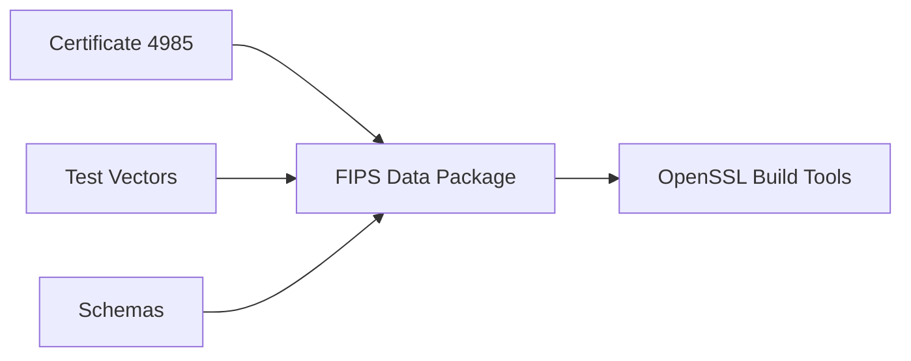

# OpenSSL FIPS Policy

FIPS 140-3 policy definitions and compliance artifacts for Certificate #4985.

## FIPS Validation Automation

This repository includes comprehensive automation for FIPS 140-3 module validation and compliance testing.

### Quick Start

```bash
# Run automated FIPS validation
./scripts/fips-validation/fips-compliance-validation.sh

# Or trigger via GitHub Actions
# Push to main branch or use workflow dispatch
```

### Validation Features

- ✅ **FIPS-Enabled Build**: Automated OpenSSL FIPS builds with Conan
- ✅ **Module Verification**: FIPS module integrity and self-test validation
- ✅ **Cross-Platform Testing**: Matrix testing across Ubuntu, Windows, macOS
- ✅ **Algorithm Validation**: Ensures approved algorithms work, restricted ones fail
- ✅ **Deprecated API Detection**: Compilation tests and CodeQL security scans
- ✅ **SBOM Generation**: Software bill of materials with certificate extraction
- ✅ **Security Scanning**: Vulnerability assessment with Trivy
- ✅ **Performance Assurance**: <8 minute runtime validation

## Usage

```bash
conan remote add ${CONAN_REPOSITORY_NAME} ${CONAN_REPOSITORY_URL} --force
conan install --requires=openssl-fips-data/140-3.1 -r=${CONAN_REPOSITORY_NAME}
```

## Architecture

Schemas
------
This repository reserves `fips-140-3/schemas/` for future JSON schema validation of certificate and vector formats.


