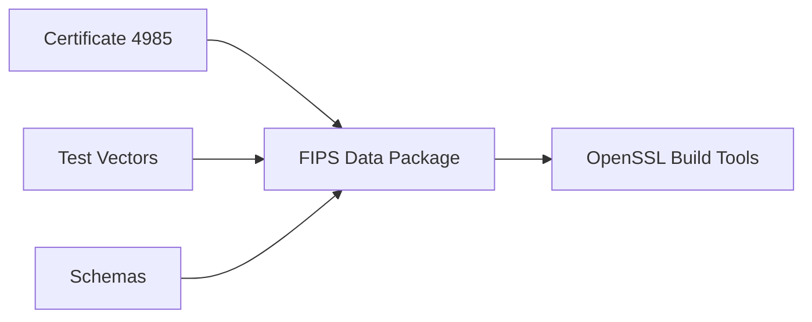

# OpenSSL FIPS Policy

FIPS 140-3 policy definitions and compliance artifacts.

## Usage

```bash
conan remote add sparesparrow-conan https://conan.cloudsmith.io/sparesparrow-conan/openssl-conan/ --force
conan install --requires=openssl-fips-data/140-3.1 -r=sparesparrow-conan
```

## Architecture

Schemas
------
This repository reserves `fips-140-3/schemas/` for future JSON schema validation of certificate and vector formats.


